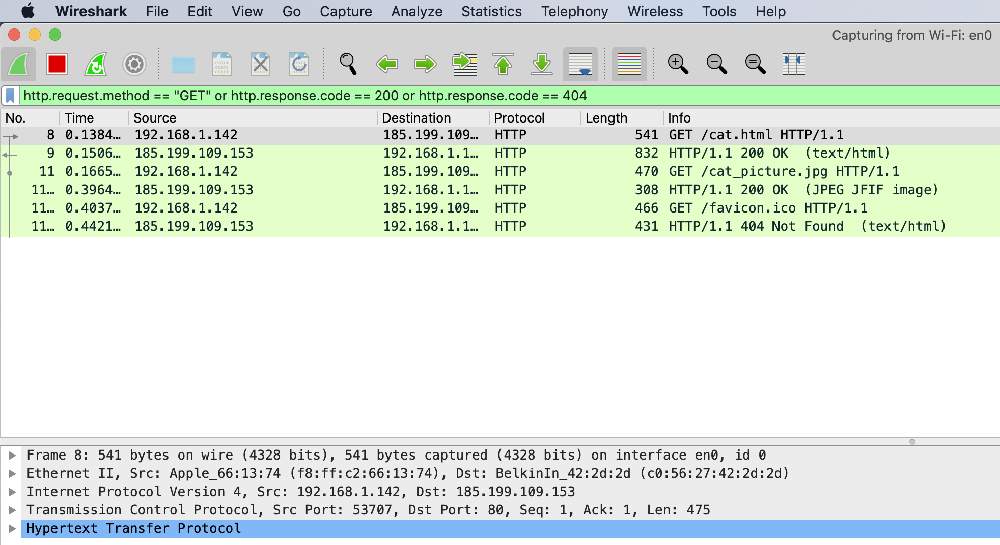

# catopia

This is the example website for the *How Does the Internet Work?* zine.

It uses HTTP instead of HTTPS to make requests easily inspectiable in Wireshark (otherwise they would be encrypted using TLS/SSL).

## How I Made It

This website was created using [GitHub Pages](https://pages.github.com/).

1. I followed [GitHub's instructions](https://help.github.com/en/github/working-with-github-pages/creating-a-github-pages-site) to create a GitHub Pages site. After that, my site was live at https://arcticmatt.github.io/catopia/index.html.
2. Since I want the HTTP requests and responses to be easily inspectable in Wireshark, and you can only turn off HTTPS by using a custom domain, I bought catopia.me using godaddy.com.
3. I followed [GitHub's instructions](https://help.github.com/en/github/working-with-github-pages/managing-a-custom-domain-for-your-github-pages-site) to set up a custom domain for my site. Since I used GoDaddy, I also followed [their instructions](https://www.godaddy.com/help/add-a-cname-record-19236). This basically amounted to:
    4. Setting a custom domain in the settings of the GitHub repository. 
    5. Adding a CNAME record in GoDaddy.
    6. Adding multiple A records in GoDaddy. GitHub's instructions omitted this step, but it's described [here](https://medium.com/@kimcodes/setting-up-a-web-page-with-github-pages-f77d45573ab2). If you don't do this, your website will be "parked."

    
After those few steps, www.catopia.me was live!

## Inspecting Requests Using Wireshark

Here's a very short demo, assuming you've already installed Wireshark.

1. Open Wireshark, and select which interface you want to capture (probably Wi-Fi).
2. Use a display filter of `http.request.method == "GET" or http.response.code == 200 or http.response.code == 404`.
3. Go to http://catopia.me/cat.html. To make sure you're seeing the right stuff in Wireshark, you can press `Cmd-Shift-r` once there (to ignore the cache) to load the page again. Then, you should see something similar to what's shown below.

Here, you can see three HTTP requests/responses.

1. One to get cat.html, which succeeds.
2. One to get cat.jpg, which succeeds.
3. One to get favicon.ico, which fail (because that resource does not exist).

